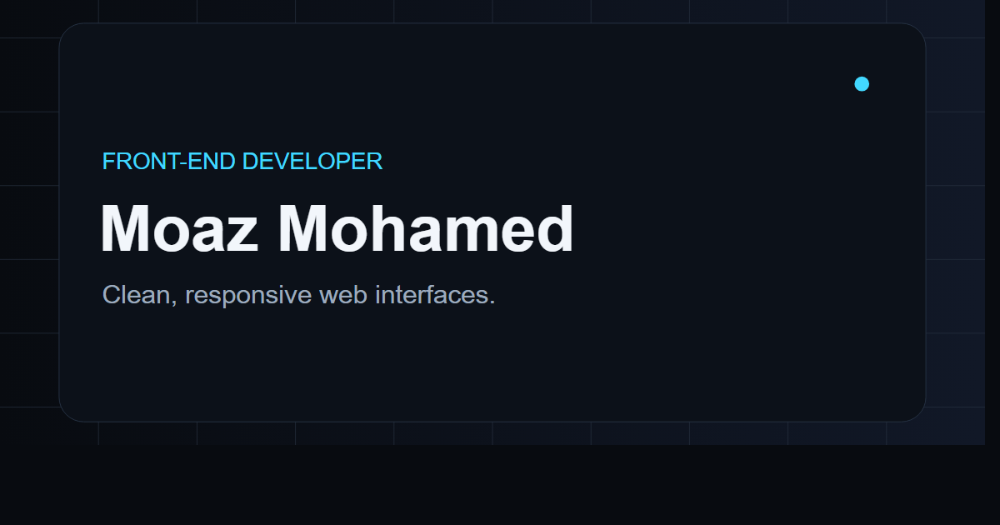

# Moaz Mohamed — Portfolio V2

A dark, responsive personal portfolio for Moaz Mohamed, a Front-End Developer and Computer Science student in Cairo, Egypt. The site presents selected projects, frontend practice, technical skills, education, certifications, and contact links with honest positioning and a strong emphasis on real project work.

## Preview



## Features

- Large case-study presentation for three featured projects
- Real project screenshots in responsive browser frames
- Original, CSS-built frontend workspace hero visual
- Compact learning-build cards and grouped technical toolkit
- Accessible sticky navigation with a keyboard-friendly mobile menu
- Active-section navigation, subtle reveal motion, and desktop cursor lighting
- Reduced-motion support, visible focus styles, and semantic page structure
- Responsive layouts tested across desktop, tablet, and mobile widths
- No framework or runtime dependency; ready for GitHub Pages

## Technologies

- Semantic HTML5
- Modern CSS with custom properties
- Vanilla JavaScript

## Featured projects

- [Inventra](https://moaz-mohamed1.github.io/inventra-landing-page/) — Inventory management SaaS front-end concept
- [FlowPilot](https://moaz-mohamed1.github.io/flowpilot-landing-page/) — Project management SaaS landing page concept
- [Subnet Calculator System](https://moaz-mohamed1.github.io/Subnet-Calculator-System/) — Networking and hardware/software integration project

## Folder structure

```text
.
├── index.html
├── css/
│   └── style.css
├── js/
│   └── main.js
├── assets/
│   ├── icons/
│   │   └── favicon.svg
│   └── images/
│       ├── projects/
│       │   ├── inventra.png
│       │   ├── flowpilot.png
│       │   └── subnet-calculator.png
│       ├── social-preview.png
│       └── social-preview.svg
└── README.md
```

## Run locally

No build step is required. Open `index.html` directly, or serve the folder with any static server.

```bash
npx serve .
```

Then visit the local URL shown by the server.

## Deployment

The project is suitable for GitHub Pages. In the repository settings, set Pages to deploy from the main branch root. All asset paths are relative and require no environment configuration.

## Author

**Moaz Mohamed** — Front-End Developer & Computer Science Student

- [GitHub](https://github.com/Moaz-Mohamed1)
- [LinkedIn](https://www.linkedin.com/in/moaz-mohamed-023050365)
- [Email](mailto:moazalbably6@gmail.com)
